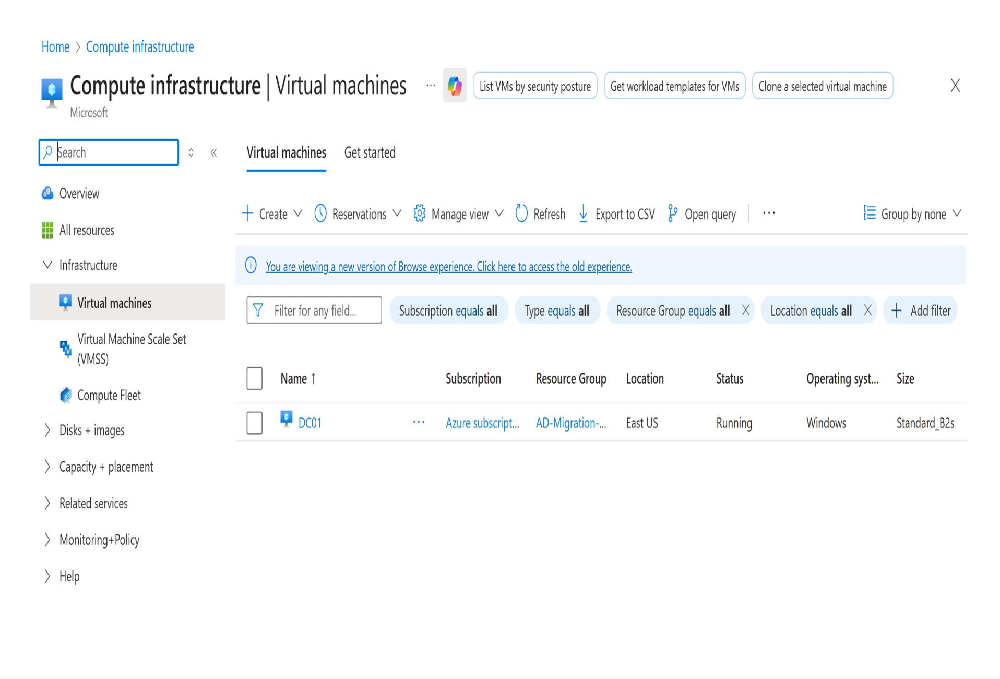
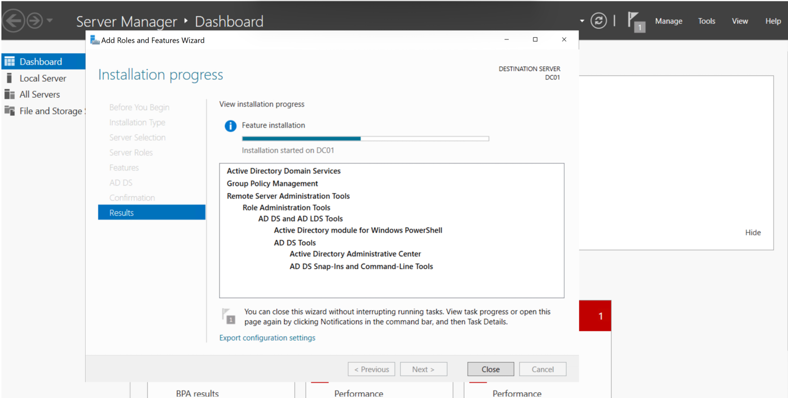
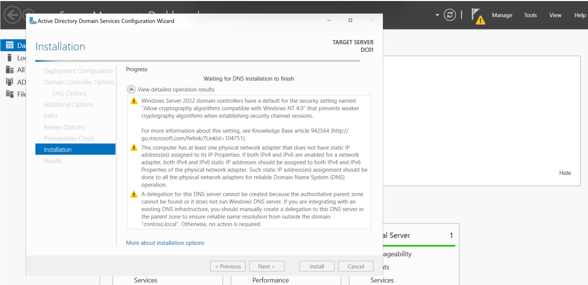
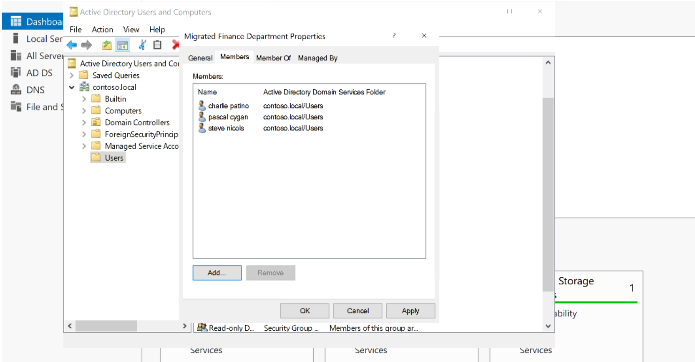
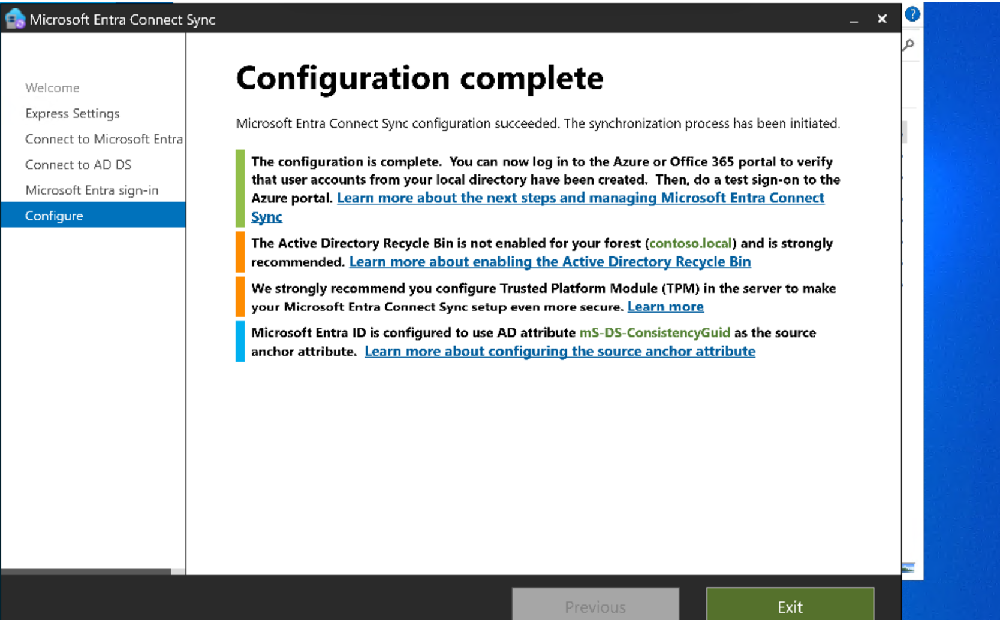
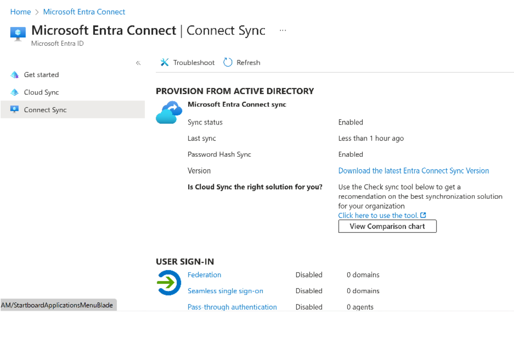
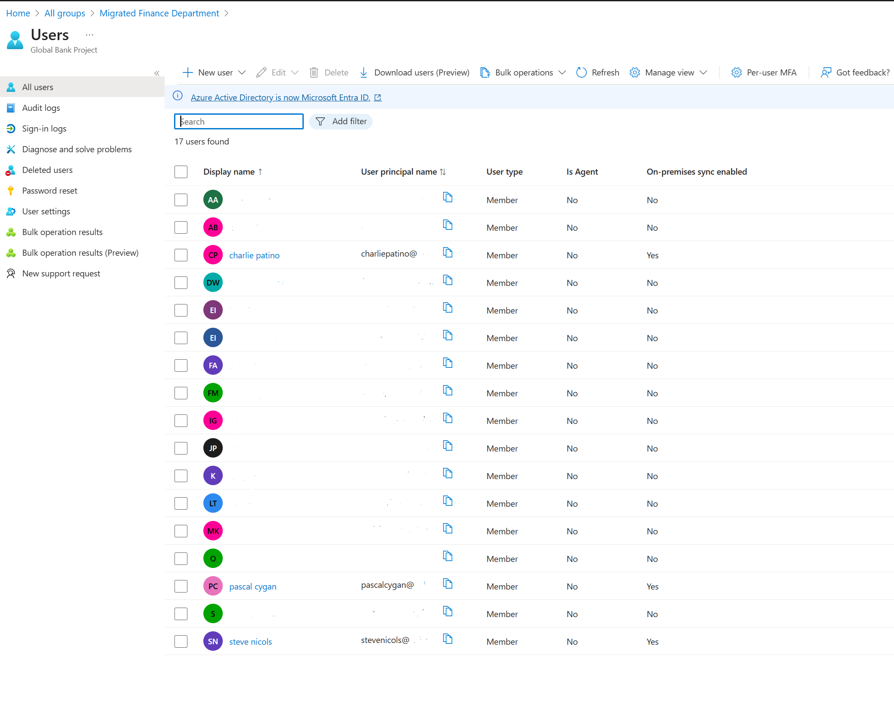
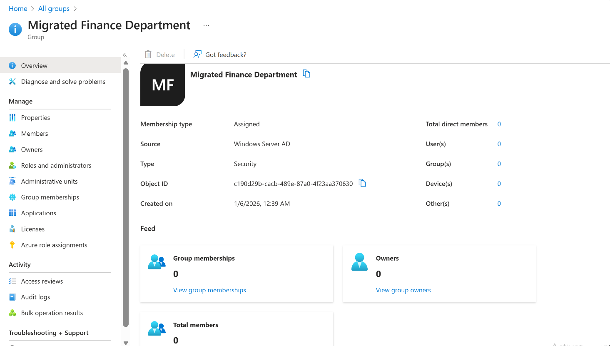
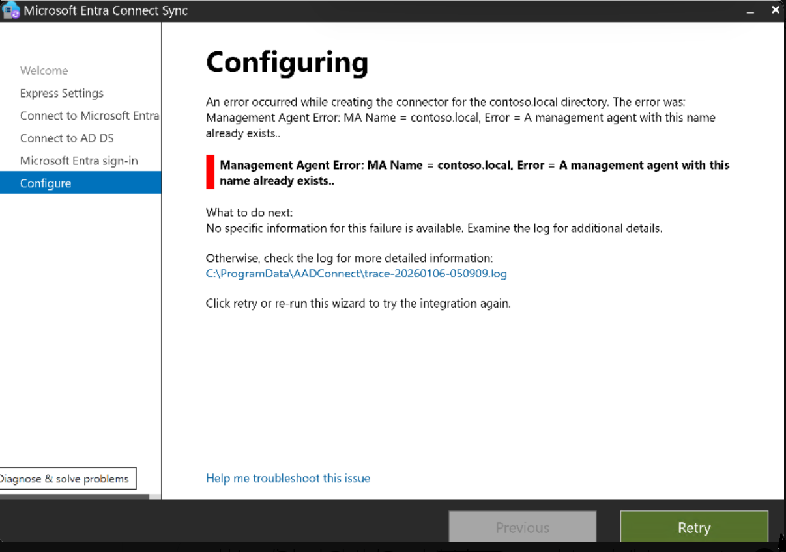

# Hybrid Active Directory to Microsoft Entra ID Migration Lab

**Project Overview**  
Hands-on simulation of a real-world hybrid identity migration from on-premises Active Directory to Microsoft Entra ID (formerly Azure AD).  
An Azure VM acts as a mock on-prem domain controller. The lab demonstrates provisioning a domain, configuring Entra Connect Sync, and synchronizing users/groups/password hashes to a cloud tenant.

**Why This Lab & Goals**  
Most organizations today operate in hybrid environments: legacy on-prem AD for certain workloads, while moving to Microsoft 365 and Entra ID for cloud authentication, security, and management.  

This lab simulates a realistic migration path:  
- Build a mock on-prem AD domain in Azure  
- Install and configure Microsoft Entra Connect Sync (traditional/full-featured tool)  
- Sync users, groups, and password hashes to Entra ID  
- Highlight key concepts and common limitations (non-routable domains, primary group sync behavior)  
- Document real troubleshooting to show practical problem-solving  

Completed independently through multiple blockers (installer conflicts, credential issues, domain limitations) without following a single guided video/script.  
Goal: Demonstrate foundational hybrid identity skills valuable for Azure/Entra ID admin or cloud migration roles.

**Key Technologies**  
- Azure Virtual Machines (Windows Server 2022)  
- Active Directory Domain Services (AD DS)  
- Microsoft Entra Connect Sync  
- Microsoft Entra ID  

## Architecture (Diagram to be added)

*Placeholder: Simple diagram showing DC01 (contoso.local) → Entra Connect Sync → Entra ID tenant with synced users/groups.*  
(Add later as: `./imgs/00-architecture.png`)

## Project Phases

### Phase 1: Deploy Mock On-Prem Domain Controller

  
*Azure Portal: DC01 VM overview (Standard_B2s, Running, East US)*

  
*Server Manager: Active Directory Domain Services role installation complete*

  
*AD DS Configuration Wizard: Promotion in progress (DNS warnings visible)*

  
*Active Directory Users and Computers: "Migrated Finance Department" group with test users*

### Phase 2: Install and Configure Microsoft Entra Connect Sync

  
*Entra Connect wizard: Configuration succeeded (with standard lab warnings)*

### Phase 3: Verify Synchronization

  
*Entra admin center: Connect Sync blade – Status Enabled, Password Hash Sync Enabled*

  
*Entra ID Users blade: Test users synced (On-premises sync enabled = Yes)*

**Note on Group Membership**  
The synced security group "Migrated Finance Department" appears with **0 members** despite on-prem assignments.  

This is expected in Entra Connect Sync:  
- Primary group memberships (e.g., default "Domain Users") **do not sync** by design.  
- Only secondary (non-primary) memberships propagate.  

In production, use secondary groups or dynamic membership rules in Entra ID.

  
*Entra ID group properties: Total direct members = 0 (proof of sync + limitation awareness)*

## Challenges & Lessons Learned
- **"Management agent already exists" error** during connector creation → resolved by uninstalling and reinstalling Entra Connect Sync (clean config reset).  
    
  *Screenshot of the error message in the Entra Connect wizard – common conflict with leftover configurations*

- Credential format issues on AD DS connection page → tested variations (CONTOSO\user, .\user, user@contoso.local).  
- IE Enhanced Security Configuration blocked login page → disabled for Administrators.  
- Non-routable UPN suffix (`contoso.local`) warning → bypassed with "Continue without matching" checkbox.  
- Primary group membership not syncing → understood Microsoft design choice and implications for group visibility.

These real blockers and resolutions highlight practical troubleshooting beyond basic setup.

## Future Improvements
- Add verified custom domain for seamless sign-in testing  
- Enable pass-through authentication or federation  
- Configure OU filtering, attribute mapping, staged rollout  
- Integrate with Conditional Access from prior projects

Built January 2026 | Independent Azure Portfolio Project  
Star if useful! 🚀
